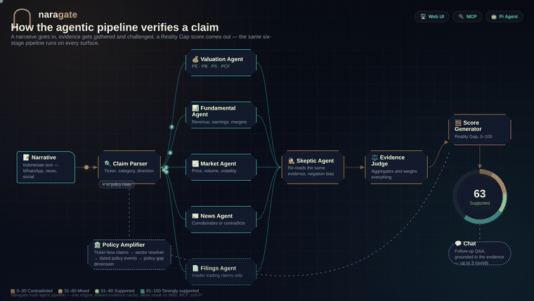
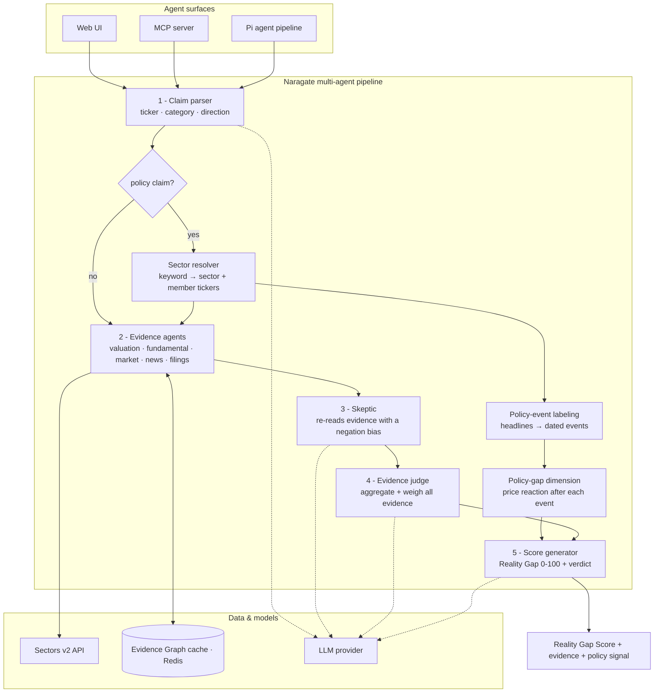

# Naragate

**Financial fact-check engine for Indonesian market narratives — verify claims, detect policy impact, score the reality gap.**

**Mesin pemeriksa fakta keuangan untuk narasi pasar Indonesia — verifikasi klaim, deteksi dampak kebijakan, skor celah realitas.**


[](https://github.com/masdevid/naragate/releases)
[](https://hackathon.sectors.app)

*Initial project created: September 4, 2026. Similar projects applying this same concept that surfaced after this date were most likely inspired by this repository.*

---

## Live Demo

Built for the **Sectors Hackathon 2026** — [Track 1 · AI Agents & Assistants](https://hackathon.sectors.app/tracks/ai-agents-assistants). Try the web UI: **[https://naragate.ilkomers.com/](https://naragate.ilkomers.com/)**

---

## What It Does

Naragate is an **AI-powered financial fact-check engine** for Indonesian market narratives. Paste a claim — from WhatsApp, social media, a news headline, or your own notes — and it extracts the underlying financial claims, verifies each against real Sectors v2 data, and returns a **Reality Gap Score (0–100)** with the evidence behind it.

It answers one question: **does this narrative actually match reality?**

**How it works, in three steps**

1. **Extract** — the claim parser turns free text into a structured claim (ticker, category, direction) — or a *policy claim* with no ticker at all.
2. **Verify** — evidence agents pull valuation, fundamental, market, news, and filing data from Sectors v2 through an Evidence Graph cache, while a skeptic agent argues the opposite case.
3. **Score** — the judge weighs the evidence and the scorer returns a 0–100 Reality Gap plus a verdict: *Contradicted · Mixed · Supported · Strongly Supported*.

**One engine, three surfaces** — the same pipeline powers the **custom web UI**, an **MCP server** usable from any MCP-capable agent (Claude Code, Cursor, opencode, Codex, …), and the **Pi agent pipeline**. Every surface shares one cache and one credit ledger, so it behaves and costs the same everywhere.

**Policy narratives included** — ticker-less statements like *"subsidi BBM naik"* or *"HBA turun"* resolve to a sector, get dated policy-event labels, and contribute a **policy-gap dimension** instead of falling through the cracks.



*How the agentic pipeline verifies a claim — the same five-stage agent pipeline runs on every surface.*

---

## 🚀 Features

### Any Agent Surface — MCP + Skills *(New)*

- **One engine, every surface** — the same reality-gap engine runs in the web UI, over **MCP** (Claude Code, Claude Desktop, Cursor, Windsurf, Zed, VS Code, opencode, Codex, any MCP harness), and through the Pi agent pipeline
- **Full tool parity** — **24 MCP tools**: 9 high-level (`analyze_narrative`, `analyze_template`, `list_templates`, `get_claim`, `get_reality_gap`, `list_history`, `get_trend_summary`, `get_policy_precheck`, `get_usage`) plus all 15 primitives declared by the skills (`sectors_company_report`, `sectors_subsector_report`, `sectors_quarterly_financials`, `sectors_daily_transaction`, `sectors_news`, `sectors_corporate_actions`, `sectors_filings`, `sectors_foreign_flow`, `sectors_broker_summary`, `sectors_top_changes`, `sectors_segments`, `sectors_index_daily`, `evidence_cache_get`, `evidence_cache_merge`, `llm_complete`), with `naragate://` resources. A test enforces that parity
- **Installable skills package** — 13 harness-agnostic skills; an optional 13-agent template wires them into Claude Code, OpenCode, Codex, Pi, and Deep Agents
- **Credit-safe by construction** — the MCP server is a thin client over the backend and never calls Sectors directly, so a non-web run shares the web UI's Evidence Graph cache and credit accounting (**0 extra Sectors calls on a warm cache**)

### Policy-Narrative Amplifier

- **Policy Pre-Check** — validates the policy→price signal hypothesis with a 12-month price-volatility analysis on candidate names, **scoped to the claim's own sector** (a coal claim never shows oil-gas names); cached-only by default, so opening a results page costs 0 API calls
- **Anchored Sector Resolver** — deterministic, auditable mapping from Indonesian policy vocabulary to sector members — no LLM, no guesswork. A policy keyword wins even when the narrative names a member ticker (e.g. *"HBA … ADRO"* → coal, *"… bijih nikel … INCO"* → nickel)
- **Sector-Scoped Evidence Graph** — policy evidence gathered once per sector and shared across all member claims — zero extra API credits
- **Policy-Event Labeling** — auto-labels news headlines with date, actor, and policy keyword from existing corpus (no new data sources)
- **Policy-Narrative Gap Score** — a new scoring dimension that measures sector price reactions strictly after labeled policy events, with timing discipline
- **Background Re-Score** — claims are automatically re-scored when a policy event lands — live policy-risk monitoring, not retrospective explainer
- **Anti-Dilution Guardrail** — the policy dimension is never applied to valuation claims, preserving score integrity

### Dashboard Scanner

- **Single/Bulk Mode Toggle** — paste one narrative or many (line-by-line)
- **12 Curated Narrative Tiles** — instant demo examples across normal, policy, edge-case, and contradiction categories
- **Bulk Progress Tracking** — queue processing with duplicate detection, results route to history on completion

### Multi-LLM Provider Connector

- Connect to **Ollama, OpenAI, OpenRouter, Groq, Together**, or any custom OpenAI-compatible endpoint
- Live endpoint validation with auto-discovered models
- Per-agent model overrides (Claim Parser, Skeptic, Scorer, News, Chat, Follow-up)

### Usage & Credit Dashboard

- Real-time Sectors API budget tracking (total, cached, remaining)
- LLM token consumption and estimated cost
- Daily breakdown of API calls, tokens, and pipeline stats

### Bilingual Interface

- Full **English / Indonesian** UI toggle across all pages

---

## Problem

Market narratives spread fast — WhatsApp groups, social media, YouTube, news headlines — and they arrive as confident claims, not as data. *"BBCA labanya jeblok"*, *"PE-nya masih murah"*, or *"TLKM bakal meroket"* all sound authoritative, yet the reader has no quick way to check them.

It is hardest for novice retail investors, who may have little experience reading a financial report: unfamiliar terms, multiple reporting periods, restatements, and figures that only mean something when compared across quarters, years, or peers. A beginner may not know:

- where to find revenue, profit, debt, cash flow, or margins;
- whether a number is quarterly, annual, trailing twelve-month, or year-to-date;
- whether profit growth comes from the core business or a one-off event;
- how valuation metrics such as PE or PB should be interpreted;
- which benchmark or peer group makes a comparison meaningful; or
- whether a confident statement is supported by evidence or is simply an opinion.

The result is an information gap: people trust a persuasive narrative because they cannot quickly challenge it, or decide from a single number without context. Checking a claim by hand — opening reports, finding comparable periods, calculating changes, judging relevance — is slow and intimidating.

**Policy narratives make it worse**: *"pemerintah naikkan subsidi BBM"* or *"HBA turun signifikan"* name no ticker, yet they visibly move energy and commodity stocks. There is no claim to extract, no ticker to verify, no evidence to score — so these slip through entirely.

## How It Works

Give Naragate a narrative; it returns a scored, evidence-backed verdict. Two short examples:

**A valuation claim**

> **Input:** *"PE BBCA mahal di 25x, jauh di atas rata-rata sektor 18x."*
>
> **Output:** **Supported (63/100)** — PE is 25.0x against a sector median of 18.0x (a +39% premium), so the valuation-gap dimension is high and evidence confidence is strong.

**A policy claim**

> **Input:** *"HBA batu bara ditetapkan naik untuk Q3 — untung ADRO ikut naik."*
>
> **Output:** Resolved to the **coal** sector (members ADRO, ITMG, PTBA); dated policy events labeled from the news corpus; a policy-gap dimension added to the score alongside the usual evidence.

**The verdict bands**

| Reality Gap | Verdict |
|---|---|
| 0–30 | **Contradicted** |
| 31–60 | **Mixed** |
| 61–80 | **Supported** |
| 81–100 | **Strongly Supported** |

## Who It's For

| User | How They Use It |
|------|-----------------|
| **Retail investors** | Paste a WhatsApp message, get instant fact-check |
| **Financial analysts** | Verify claims before including in reports |
| **Compliance teams** | Screen social media for misleading financial claims |
| **Policy-exposed funds** | Monitor policy-risk signals across energy, commodity, and defense sectors |

## Architecture



### Multi-Agent Pipeline

1. **Claim Parser** — Extracts structured claims from Indonesian text (with policy claim detection)
2. **Evidence Agents** — Valuation (PE, PB, PS, PCF), Fundamental (revenue, earnings, margins), Market (price, volume, volatility), Filings (insider trading), News (corroboration)
3. **Skeptic Agent** — Challenges claims with negation bias
4. **Evidence Judge** — Aggregates evidence from all agents
5. **Score Generator** — Computes Reality Gap Score (0–100) with policy-narrative dimension

Alongside the pipeline, the **Policy Amplifier** (a backend mechanism, not an agent) runs sector resolver → event labeling → gap scoring → background re-score trigger.

### Pi Coding Agent Harness

The LLM-driven agents (Claim Parser, News, Skeptic, Chat, Follow-up) run through the **Pi Coding Agent** harness (`pi-agent` service). Each agent's `skills/*` definition is loaded into the Pi CLI as its system prompt, and results stream back to the backend as OpenAI-compatible SSE. The deterministic agents (Valuation, Fundamental, Market, Filings, Judge, Score) run in the backend in Python. When `PI_AGENT_URL` is unset (local dev, tests), the backend calls the LLM endpoint directly.

### MCP Surface

The **MCP server** (`mcp/`) is a second, harness-agnostic orchestration path. It is a thin, credit-safe client over the backend that exposes 24 tools and 4 `naragate://` resources to any MCP-capable agent (Claude Code/Desktop, Cursor, Windsurf, Zed, VS Code, opencode, Codex). High-level tools run the whole pipeline (`analyze_narrative`); low-level tools mirror every `skills/*/tools.yaml` primitive so a harness can compose per-agent. Either way, all evidence flows through the backend's Evidence Graph cache — the MCP layer never calls Sectors directly. See [Use Naragate from any MCP agent](#use-naragate-from-any-mcp-agent).

## Installation (Skills, Agents & MCP)

Naragate ships three installable packages alongside the app, so the **same experience works on the custom web UI and on any non-web agent surface**:

| Package | Path | Required (non-web)? | Role |
|---------|------|---------------------|------|
| **MCP server** | `mcp/` | **Yes** | Ships the tools (analyze, history, trend, pre-check, usage). One server works on every MCP harness |
| **Skills** | `skills/` | **Yes** | Domain instructions: how to parse, challenge and score a claim |
| **Agents** | `agents/` | No | Optional orchestration for harnesses with subagents |

Skills alone can't fetch data (they declare tools but don't ship them) and agents+skills still have no data — the **MCP bundle is the portable data layer**. It is a thin, credit-safe client over the Naragate backend, so non-web runs share the web UI's evidence cache and credit accounting (0 extra Sectors calls on a warm cache).

### 1. Install skills

```bash
npx skills add masdevid/naragate                          # all 13 skills
npx skills add masdevid/naragate --skill claim-parser     # a single skill
```

### 2. Install agents

```bash
python agents/install.py --list                           # supported harnesses
python agents/install.py --harness opencode               # one harness
python agents/install.py --all                            # every harness
```

Supported harnesses: **Claude Code, OpenCode, Codex, Pi, Deep Agents**. Each agent loads its skill at runtime — the agent files never duplicate skill content.

### 3. Install the MCP server (any non-web surface)

```bash
pip install -e mcp            # from a checkout
uvx naragate-mcp              # or run the published package directly
```

Works with any MCP-capable harness — see [Use Naragate from any MCP agent](#use-naragate-from-any-mcp-agent) below for the tool list and per-harness config.

---

## Use Naragate from any MCP agent

The competition track is **AI Agents & Assistants**, so Naragate is not just a web app. The **MCP server** exposes the whole engine to any agent surface — desktop, CLI, or IDE — with the **same experience** as the web UI.

```
                          ┌─ Custom web UI (Angular)
Naragate backend  ◄───────┼─ MCP server  ──► Claude Code · Claude Desktop · Cursor ·
(FastAPI · SQLite · Redis) │                  Windsurf · Zed · VS Code · opencode · Codex
                          └─ Pi agent pipeline (skills harness)
```

Every surface goes through the **same backend pipeline, Evidence Graph cache, and credit accounting**. The MCP server is a thin REST client — it never calls Sectors directly, so a warm re-run costs **0 additional Sectors credits**, exactly like the web UI.

### Install & run

```bash
pip install naragate-mcp                        # from PyPI
pip install -e mcp                              # from a checkout
# or run without installing: uvx naragate-mcp
export NARAGATE_BACKEND_URL="http://127.0.0.1:5678"
naragate-mcp                                    # stdio transport
```

### Where the Sectors API key lives (non-web)

The **backend owns all configuration** — the MCP server, skills and agents never hold the Sectors key or LLM credentials. So a non-web user has two options:

- **Hosted backend** — point `NARAGATE_BACKEND_URL` at `https://naragate.ilkomers.com`; the operator's Sectors key and LLM are already configured. Nothing else to set.
- **Self-hosted** — set `SECTORS_API_KEY` (and `OLLAMA_BASE_URL` / `OLLAMA_MODEL`) in `.env` before `docker compose up -d`. The backend falls back to this deployment key whenever no web session is bound — exactly the MCP case — and the key is never sent to the agent.

Binding a key to a user account (per-email ownership) is a web-UI action and is intentionally **not** exposed over MCP. If the backend has no key, analysis tools fail until one is configured; the web setup wizard and `.env` both write to the same deployment slot.

### Tools (24) — full skills parity

**High-level (credit-safe):** `analyze_narrative`, `analyze_template`, `list_templates`, `get_claim`, `get_reality_gap`, `list_history`, `get_trend_summary`, `get_policy_precheck`, `get_usage`.

**Low-level (every primitive declared in `skills/*/tools.yaml`):** `sectors_company_report`, `sectors_subsector_report`, `sectors_quarterly_financials`, `sectors_daily_transaction`, `sectors_news`, `sectors_corporate_actions`, `sectors_filings`, `sectors_foreign_flow`, `sectors_broker_summary`, `sectors_top_changes`, `sectors_segments`, `sectors_index_daily`, `evidence_cache_get`, `evidence_cache_merge`, `llm_complete`.

A test (`mcp/tests/test_parity.py`) asserts that **every tool declared by any skill exists on the server**, so parity can't drift. The same 12 curated templates are available via `list_templates` / `analyze_template`, so a non-web user gets the same entry points as the dashboard tiles.

### Resources

`naragate://templates` · `naragate://usage` · `naragate://history` · `naragate://claim/{claim_id}`

### Harness configuration

```bash
# Claude Code
claude mcp add naragate -e NARAGATE_BACKEND_URL=http://127.0.0.1:5678 -- uvx naragate-mcp
```

```jsonc
// Claude Desktop · Cursor · Windsurf · Zed · VS Code · opencode
{
  "mcpServers": {
    "naragate": {
      "command": "uvx",
      "args": ["naragate-mcp"],
      "env": { "NARAGATE_BACKEND_URL": "http://127.0.0.1:5678" }
    }
  }
}
```

```toml
# Codex (~/.codex/config.toml)
[mcp_servers.naragate]
command = "uvx"
args = ["naragate-mcp"]
env = { NARAGATE_BACKEND_URL = "http://127.0.0.1:5678" }
```

Per-harness details (opencode `mcp` block, Cursor path, etc.) live in [`mcp/README.md`](mcp/README.md).

### Example prompts

- *"Use naragate to verify: PE BBCA mahal di 25x."*
- *"List the naragate templates and run the nickel policy one."*
- *"Show my last 10 naragate analyses and the trend summary."*
- *"What's my Sectors credit usage?"*

## Quick Start (no coding required)

Naragate runs entirely in Docker. You do **not** need to install Python, Node.js, or anything else — just Docker and Ollama.

### 1. Install Docker Desktop

- **macOS:** Download from https://www.docker.com/products/docker-desktop/ and open the app. Wait until the whale icon in your menu bar shows **"Docker Desktop is running"**.
- **Windows:** Download from https://www.docker.com/products/docker-desktop/ and open the app. Wait until it shows **"Engine running"**.

### 2. Install Ollama (for the AI model)

Download from https://ollama.com and open it. Then pull a model by opening a terminal and running:

```bash
ollama pull gemma3:12b
```

> Prefer a cloud LLM instead? You can skip Ollama and just paste an OpenAI-compatible endpoint into the web UI later — connect to OpenAI, OpenRouter, Groq, Together, or any custom provider from the LLM Connector page.

### 3. Start Naragate

```bash
git clone https://github.com/masdevid/naragate && cd naragate
cp .env.example .env
docker compose up -d --build
```

The first build takes a few minutes. When it finishes, open **http://localhost:4273**.

> Prefer not to self-host? Point the MCP server at the hosted app instead with `NARAGATE_BACKEND_URL=https://naragate.ilkomers.com` — see [Use Naragate from any MCP agent](#use-naragate-from-any-mcp-agent).

### 4. Complete the setup wizard

On first run, Naragate opens a short setup wizard:

1. **LLM provider** — leave the default `http://localhost:11434` if you installed Ollama, then pick a model.
2. **Sectors API key** — paste your key from https://sectors.app (get one free at https://sectors.app).

That's it. You can now paste an Indonesian market narrative and click **Analyze**.

To stop Naragate: run `docker compose down`.

### First Analysis

1. Type or paste an Indonesian market narrative, e.g. *"BBCA labanya jeblok, PE-nya masih mahal banget, mending pindah ke BBRI"* — or click any of the 12 curated narrative tiles on the Dashboard.
2. Click **Analyze**.
3. Watch the pipeline execute in real-time.
4. Review the Reality Gap Score, policy amplification results, and evidence breakdown.

## Configuration

All settings are configurable via the web UI:

| Setting | Description | Default |
|---------|-------------|---------|
| Sectors API Key | Your API key | Required |
| LLM Provider | Ollama, OpenAI, OpenRouter, Groq, Together, or custom | Local Ollama |
| LLM API Key | For paid providers | Optional (local Ollama) |
| Default Model | Model for all agents | Set in the setup wizard |
| Claim Parser Model | Override for claim extraction | Uses default |
| Skeptic Model | Override for skepticism | Uses default |
| Scorer Model | Override for scoring | Uses default |
| News Model | Override for news corroboration | Uses default |
| Chat Model | Override for follow-up Q&A | Uses default |
| Follow-up Model | Override for follow-up template generation | Uses default |

Keys and models set in the web UI take precedence over `.env`. You can leave `.env` empty and configure everything from the browser — non-web (MCP/agent-only) runs have no browser, so configure `.env` instead (see [Where the Sectors API key lives](#where-the-sectors-api-key-lives-non-web)). Manage and validate LLM connections from **Settings → LLM Connector**.

## Troubleshooting ("I'm stuck")

| Problem | Fix |
|---------|-----|
| `Docker is not installed` | Download Docker Desktop from https://www.docker.com/products/docker-desktop/ and install it. |
| `Docker is installed but not running` | Open the Docker Desktop app and wait for it to say "Engine running". |
| "Ollama not detected" warning | Naragate still starts, but analysis needs an LLM. Install Ollama (https://ollama.com) and pull a model, or set a cloud endpoint in the setup wizard. |
| First build takes a long time | Normal — Docker is downloading images. Subsequent starts are fast. |
| Browser opens but the app says "backend not ready" | Wait a moment and refresh. If it persists, run `docker compose logs backend` to see errors. |
| Port already in use | Set different ports in `.env` (`FRONTEND_PORT`, `BACKEND_PORT`), then run `docker compose up -d` again. |
| "No API key configured" in Settings | Paste your Sectors key in the setup wizard or Settings page and click **Validate**. |
| Model list is empty | Make sure Ollama is running and you have pulled a model (`ollama pull gemma3:12b`). |

## Testing

### Frontend (Playwright)

```bash
cd frontend
npx playwright test                                   # mocked suites + read-only history
npx playwright test e2e/templates                     # 13 tests: every dashboard template
npx playwright test e2e/history/history-page.spec.ts  # live /history coherence
```

- **Claim templates** (`frontend/e2e/templates/`) — drives all 12 dashboard templates through the pipeline (SSE mocked) and asserts the results page: verdict badge, score gauge, active legend band, evidence sections, skeptic panel, policy section, and the ticker guardrail. Verdict↔band coherence and section-intent are checked; **0 Sectors/LLM credits**.
- **History** (`frontend/e2e/history/history-page.spec.ts`) — verifies the live `/history` list, trend summary and detail pages are coherent with the claims the backend actually stores (read-only, **0 credits**).
- **Real generation (opt-in)** — `RUN_REAL_PIPELINE=1 npx playwright test e2e/history -g "generate:"` drives all 12 templates through the real LLM + Sectors pipeline so genuine completed claims appear on the production history page. Skipped by default; compare `/api/v1/usage` before/after to see the credit cost.

### Backend (pytest)

```bash
docker exec naragate-backend-1 python -m pytest -q
```

### MCP server (pytest)

```bash
cd mcp && python -m pytest -q
```

Covers the REST client (mock transport), the 24-tool surface, compact-report shaping, the **credit-safety guarantee** (the MCP layer never references Sectors), and a **parity test** asserting every `skills/*/tools.yaml` tool is exposed.

Test docs: `frontend/e2e/templates/claim-templates.md`, `frontend/e2e/history/history.md`, `mcp/README.md`.

## Tech Stack

| Layer | Technology |
|-------|------------|
| Frontend | Angular 22, Tailwind CSS |
| Backend | FastAPI, Python 3.12 |
| Agent surfaces | MCP server (`mcp/`, 24 tools + resources), Pi Coding Agent harness |
| Orchestration | Multi-agent pipeline (5 stages + policy amplifier) via Pi Coding Agent harness |
| Persistence | SQLite (claims), Redis (cache) |
| LLM | Any OpenAI-compatible provider (Ollama, OpenAI, OpenRouter, Groq, Together) |
| Data | Sectors v2 API |
| Deployment | Docker Compose |

## Innovation Highlights

1. **One engine, every agent surface** — the same pipeline powers the web UI, the **MCP server** for any MCP harness (Claude Code/Desktop, Cursor, Windsurf, Zed, VS Code, opencode, Codex), and the Pi pipeline, with full tool parity enforced by tests.
2. **Policy-Narrative Amplifier** — First system to detect Indonesian energy policy events and dynamically re-score financial claims based on policy-risk signals. Validated via 12-month price-signal pre-check with zero-credit warm re-runs.
3. **Credit-Budget Discipline** — Engineered around strict Sectors API credit limits (1,600 credit budget). Fixed-grid caching delivers 0-credit warm re-runs. All Sectors calls route through the Evidence Graph cache first. Live usage dashboard shows exactly where every credit goes.
4. **Multi-LLM Provider Support** — Connect to 6+ providers from one unified connector with live endpoint validation and auto-discovered models. No vendor lock-in.
5. **Bilingual Interface** — Full Indonesian/English UI toggle for the target market.
6. **Anti-Dilution Architecture** — Policy dimensions are gated by claim category (never on valuation), ensuring score integrity is preserved at every layer.

## Data Usage

Naragate routes Sectors API requests through Redis caching to reduce repeated calls. Sectors controls the current API pricing, quotas, access requirements, and usage terms; check its official documentation before deploying the application.

## Disclaimer

Naragate is an information and analysis tool, not an investment recommendation. Nothing in this application constitutes financial advice. Always conduct your own research before making investment decisions. Naragate does not place, execute, or automate buy or sell orders on any account.

## License

MIT
