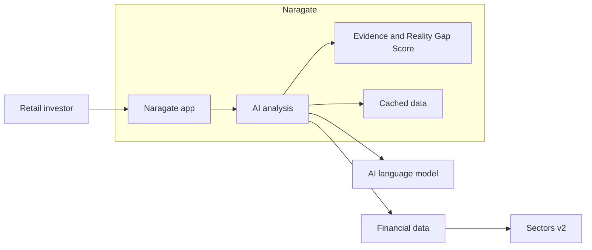

# Naragate

**AI evidence engine that detects financial claims in Indonesian market narratives and verifies them against real financial data.**

---

## Problem

Indonesian retail investors consume market narratives daily — from WhatsApp groups, social media, YouTube videos, and news headlines. Claims like *"BBCA labanya jeblok"* (BBCA's profits collapsed), *"PE-nya masih murah"* (its price-to-earnings ratio is still cheap), or *"TLKM bakal meroket"* (TLKM will skyrocket) can spread faster than a reader can verify them.

This is especially difficult for novice retail traders who have little or no knowledge of how to read a financial report. A financial report contains unfamiliar terms, multiple reporting periods, restatements, accounting categories, and figures that only make sense when compared with the previous quarter, previous year, or another company in the same sector. A beginner may not know:

- where to find revenue, profit, debt, cash flow, or margins;
- whether a number is quarterly, annual, trailing twelve-month, or year-to-date;
- whether profit growth comes from the core business or a one-off event;
- how valuation metrics such as PE or PB should be interpreted;
- which benchmark or peer group makes a comparison meaningful; or
- whether a confident statement is supported by evidence or is simply an opinion.

The result is an information gap. Beginners may trust a persuasive narrative because they cannot quickly challenge it, reject useful information because it looks too technical, or make a decision based on a single number without understanding its context. Manually checking a claim means opening several reports, finding comparable periods, calculating changes, and deciding which evidence is relevant. That process is slow and intimidating even before a beginner reaches an investment decision.

Naragate is designed to make this first verification step easier. It translates a market narrative into specific claims, connects each claim to relevant financial evidence, and explains whether the available data supports, contradicts, or only partially supports the statement. It does not remove the need to learn or perform personal research; it gives a novice a clearer starting point and questions to investigate.

## Solution

Naragate analyzes any Indonesian market narrative in real-time and produces a **Reality Gap Score** — a 0–100 measure of how strongly the financial evidence aligns with the claim.

**Input:**
> "BBCA labanya jeblok, PE-nya masih mahal banget, mending pindah ke BBRI"

**Output:**
- Extracted claims: "BBCA profits collapsed", "BBCA PE is expensive", "BBRI is better"
- Evidence: Actual PE ratios, profit margins, quarterly financials
- Verdict: **Mixed (45/100)** — profits declined but PE is within sector average

## Who It's For

| User | How They Use It |
|------|-----------------|
| **Retail investors** | Paste a WhatsApp message, get instant fact-check |
| **Financial analysts** | Verify claims before including in reports |
| **Compliance teams** | Screen social media for misleading financial claims |

## Architecture



### Multi-Agent Pipeline

1. **Claim Parser** — Extracts structured claims from Indonesian text
2. **Valuation Agent** — Retrieves PE, PB, PS, PCF metrics
3. **Fundamental Agent** — Retrieves revenue, earnings, margins
4. **Market Agent** — Retrieves price, volume, volatility data
5. **Skeletal Agent** — Challenges claims with negation bias
6. **Evidence Judge** — Aggregates evidence from all agents
7. **Score Generator** — Computes Reality Gap Score (0–100)

## Quick Start

### Prerequisites

- Docker + Docker Compose
- Sectors v2 API key (get one at https://sectors.app)
- Ollama running locally OR an OpenAI-compatible LLM provider

### Install

```bash
git clone https://github.com/your-org/naragate.git
cd naragate
cp .env.example .env
```

### Configure

Edit `.env`:

```bash
# Required
SECTORS_API_KEY=your_64_char_api_key

# LLM Provider (default: local Ollama)
OLLAMA_BASE_URL=http://localhost:11434
OLLAMA_MODEL=gemma4:12b

# Or use OpenRouter
# OLLAMA_BASE_URL=https://openrouter.ai/api/v1
# OLLAMA_MODEL=meta-llama/llama-3.1-70b-instruct
```

### Run

```bash
docker-compose up
```

Open http://localhost:4273

### First Analysis

1. Type or paste an Indonesian market narrative
2. Click **Analyze**
3. Watch the pipeline execute in real-time
4. Review the Reality Gap Score and evidence breakdown

## Configuration

All settings are configurable via the web UI at `/settings`:

| Setting | Description | Default |
|---------|-------------|---------|
| Sectors API Key | Your API key | Required |
| LLM Endpoint | OpenAI-compatible URL | `http://localhost:11434` |
| LLM API Key | For paid providers | Optional (local Ollama) |
| Default Model | Model for all agents | `gemma4:12b` |
| Claim Parser Model | Override for claim extraction | Uses default |
| Skeptic Model | Override for skepticism | Uses default |
| Scorer Model | Override for scoring | Uses default |

## API

### POST /api/v1/stream/evaluate

Stream a narrative analysis via SSE.

**Request:**
```json
{
  "narrative": "BBCA labanya jeblok, PE-nya masih mahal"
}
```

**Response (SSE):**
```
data: {"type":"claim_parsed","agent":"claim_parser","data":{...}}
data: {"type":"evidence_retrieved","agent":"valuation","data":{...}}
data: {"type":"skeptic_analysis","agent":"skeptic","data":{...}}
data: {"type":"score_computed","agent":"scorer","data":{"score":45,"verdict":"Mixed"}}
```

### GET /api/v1/health

System health check.

## Tech Stack

| Layer | Technology |
|-------|------------|
| Frontend | Angular 22, Tailwind CSS |
| Backend | FastAPI, Python 3.11 |
| Orchestration | Pi Coding Agent |
| Persistence | SQLite (claims), Redis (cache) |
| LLM | Any OpenAI-compatible provider |
| Data | Sectors v2 API |
| Deployment | Docker Compose |

## Data Usage

Naragate routes Sectors API requests through Redis caching to reduce repeated calls. Sectors controls the current API pricing, quotas, access requirements, and usage terms; check its official documentation before deploying the application.

## Development

```bash
# Backend only
cd backend && pip install -r requirements.txt && uvicorn app.main:app --reload

# Frontend only
cd frontend && npm install && ng serve

# Pi Agent only
cd pi-agent && pip install -r requirements.txt && python server.py
```

## License

MIT
