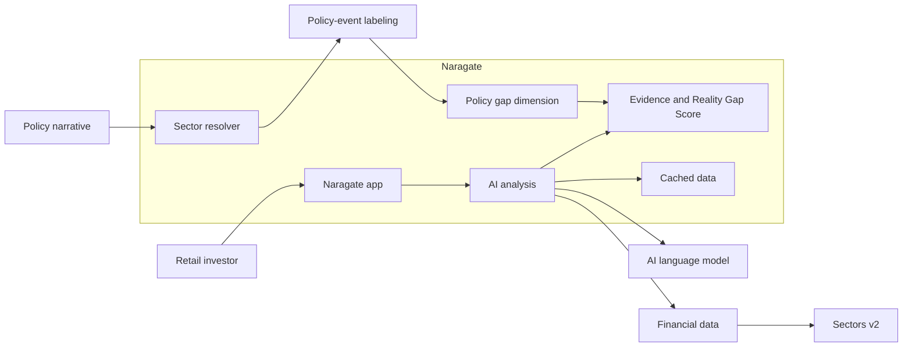

# Naragate

**AI evidence engine that detects financial claims in Indonesian market narratives — and now amplifies them with live policy intelligence.**


[](https://hackathon.sectors.app)

*Initial project created: September 4, 2026. Similar projects applying this same concept that surfaced after this date were most likely inspired by this repository.*

---

## Live Demo

Built for the **Sectors Hackathon 2026** — [Track 1 · AI Agents & Assistants](https://hackathon.sectors.app/tracks/ai-agents-assistants). Try the web UI: **[https://naragate.ilkomers.com/](https://naragate.ilkomers.com/)**

---

## What It Does

Indonesian retail investors are bombarded with market narratives every day — *"BBCA labanya jeblok"*, *"PE-nya masih mahal"*, *"Pemerintah naikkan subsidi BBM"* — and most of them are wrong, misleading, or incomplete.

Naragate is an **AI-powered financial fact-check engine** that takes any Indonesian market narrative, extracts specific financial claims, verifies them against real Sectors v2 financial data, and produces a **Reality Gap Score** (0–100) showing how strongly the evidence aligns with the claim.

**Now with the Policy-Narrative Amplifier** — a first-of-its-kind dimension that detects Indonesian energy policy events, automatically re-scores affected claims when policy news lands, and surfaces the policy-risk signal hidden inside ticker-less narratives like *"subsidi BBM naik"* or *"HBA turun"*.

---

## 🚀 Features

### Policy-Narrative Amplifier *(New)*

- **Policy Pre-Check** — validates the policy→price signal hypothesis with a 12-month price-volatility analysis on candidate energy names (zero-credit on warm re-runs)
- **Anchored Sector Resolver** — deterministic, auditable mapping from Indonesian policy vocabulary to sector members — no LLM, no guesswork
- **Sector-Scoped Evidence Graph** — policy evidence gathered once per sector and shared across all member claims — zero extra API credits
- **Policy-Event Labeling** — auto-labels news headlines with date, actor, and policy keyword from existing corpus (no new data sources)
- **Policy-Narrative Gap Score** — a new scoring dimension that measures sector price reactions strictly after labeled policy events, with timing discipline
- **Background Re-Score** — claims are automatically re-scored when a policy event lands — live policy-risk monitoring, not retrospective explainer
- **Anti-Dilution Guardrail** — the policy dimension is never applied to valuation claims, preserving score integrity

### Dashboard Scanner

- **Single/Bulk Mode Toggle** — paste one narrative or many (line-by-line)
- **12 Curated Narrative Tiles** — instant demo examples across normal, policy, edge-case, and contradiction categories
- **Bulk Progress Tracking** — queue processing with duplicate detection, results route to history on completion

### Multi-LLM Provider Connector

- Connect to **Ollama, OpenAI, OpenRouter, Groq, Together**, or any custom OpenAI-compatible endpoint
- Live endpoint validation with auto-discovered models
- Per-agent model overrides (Claim Parser, Skeptic, Scorer, Judge)

### Usage & Credit Dashboard

- Real-time Sects API budget tracking (total, cached, remaining)
- LLM token consumption and estimated cost
- Daily breakdown of API calls, tokens, and pipeline stats

### Bilingual Interface

- Full **English / Indonesian** UI toggle across all pages

---

## Problem

Indonesian retail investors consume market narratives daily — from WhatsApp groups, social media, YouTube videos, and news headlines. Claims like *"BBCA labanya jeblok"* (BBCA's profits collapsed), *"PE-nya masih murah"* (its price-to-earnings ratio is still cheap), or *"TLKM bakal meroket"* (TLKM will skyrocket) can spread faster than a reader can verify them.

This is especially difficult for novice retail traders who have little or no knowledge of how to read a financial report. A financial report contains unfamiliar terms, multiple reporting periods, restatements, accounting categories, and figures that only make sense when compared with the previous quarter, previous year, or another company in the same sector. A beginner may not know:

- where to find revenue, profit, debt, cash flow, or margins;
- whether a number is quarterly, annual, trailing twelve-month, or year-to-date;
- whether profit growth comes from the core business or a one-off event;
- how valuation metrics such as PE or PB should be interpreted;
- which benchmark or peer group makes a comparison meaningful; or
- whether a confident statement is supported by evidence or is simply an opinion.

The result is an information gap. Beginners may trust a persuasive narrative because they cannot quickly challenge it, reject useful information because it looks too technical, or make a decision based on a single number without understanding its context. Manually checking a claim means opening several reports, finding comparable periods, calculating changes, and deciding which evidence is relevant. That process is slow and intimidating even before a beginner reaches an investment decision.

**Now add policy narratives**: statements like *"pemerintah naikkan subsidi BBM"* or *"HBA turun signifikan"* don't name a ticker, but they visibly move energy, commodity, and defense-adjacent stocks. Today, these fall through the cracks — there's no claim to extract, no ticker to verify, and no evidence to score. Naragate's Policy-Narrative Amplifier closes this gap.

## Solution

Naragate analyzes any Indonesian market narrative in real-time and produces a **Reality Gap Score** — a 0–100 measure of how strongly the financial evidence aligns with the claim. With the Policy-Narrative Amplifier, it also detects policy events, resolves them to affected sector members, and feeds a new policy-narrative gap dimension into the score.

**Input:**
> *"BBCA labanya jeblok, PE-nya masih mahal banget, mending pindah ke BBRI"*

**Output:**
- Extracted claims: "BBCA profits collapsed", "BBCA PE is expensive", "BBRI is better"
- Evidence: Actual PE ratios, profit margins, quarterly financials
- Verdict: **Mixed (45/100)** — profits declined but PE is within sector average

**Policy Input:**
> *"Pemerintah naikkan subsidi BBM, dampaknya ke energi"*

**Policy Output:**
- Resolved sector: Energy (3 member tickers)
- Policy events verified with timing discipline
- Policy-narrative gap dimension integrated into Reality Gap Score for market & fundamental claims

## Who It's For

| User | How They Use It |
|------|-----------------|
| **Retail investors** | Paste a WhatsApp message, get instant fact-check |
| **Financial analysts** | Verify claims before including in reports |
| **Compliance teams** | Screen social media for misleading financial claims |
| **Policy-exposed funds** | Monitor policy-risk signals across energy, commodity, and defense sectors |

## Architecture



### Multi-Agent Pipeline

1. **Claim Parser** — Extracts structured claims from Indonesian text (with policy claim detection)
2. **Evidence Agents** — Valuation (PE, PB, PS, PCF), Fundamental (revenue, earnings, margins), Market (price, volume, volatility), News (corroboration)
3. **Skeptic Agent** — Challenges claims with negation bias
4. **Evidence Judge** — Aggregates evidence from all agents
5. **Score Generator** — Computes Reality Gap Score (0–100) with policy-narrative dimension
6. **Policy Amplifier** — Sector resolver → Event labeling → Gap scoring → Background re-score trigger

### Pi Coding Agent Harness

The LLM-driven agents (Claim Parser, Skeptic, News, Chat) run through the **Pi Coding Agent** harness (`pi-agent` service). Each agent's `skills/*` definition is loaded into the Pi CLI as its system prompt, and results stream back to the backend as OpenAI-compatible SSE. The deterministic data agents (Valuation, Fundamental, Market, Judge, Score) run in the backend in Python. When `PI_AGENT_URL` is unset (local dev, tests), the backend calls the LLM endpoint directly.

## Installation (Skills & Agents)

Naragate ships two installable packages alongside the app: **skills** (`skills/`) and an **agents template** (`agents/`). Install the skills first, then generate the agents for your harness.

### 1. Install skills

```bash
npx skills add masdevid/naragate                          # all 11 skills
npx skills add masdevid/naragate --skill claim-parser     # a single skill
```

### 2. Install agents

```bash
python agents/install.py --list                           # supported harnesses
python agents/install.py --harness opencode               # one harness
python agents/install.py --all                            # every harness
```

Supported harnesses: **Claude Code, OpenCode, Codex, Pi, Deep Agents**. Each agent loads its skill at runtime — the agent files never duplicate skill content.

## Quick Start (no coding required)

Naragate runs entirely in Docker. You do **not** need to install Python, Node.js, or anything else — just Docker and Ollama.

### 1. Install Docker Desktop

- **macOS:** Download from https://www.docker.com/products/docker-desktop/ and open the app. Wait until the whale icon in your menu bar shows **"Docker Desktop is running"**.
- **Windows:** Download from https://www.docker.com/products/docker-desktop/ and open the app. Wait until it shows **"Engine running"**.

### 2. Install Ollama (for the AI model)

Download from https://ollama.com and open it. Then pull a model by opening a terminal and running:

```bash
ollama pull gemma3:12b
```

> Prefer a cloud LLM instead? You can skip Ollama and just paste an OpenAI-compatible endpoint into the web UI later — connect to OpenAI, OpenRouter, Groq, Together, or any custom provider from the LLM Connector page.

### 3. Start Naragate

- **macOS / Linux:** double-click `start.sh` (or run `./start.sh` in a terminal).
- **Windows:** double-click `start.bat`.

The script checks Docker, copies `.env.example` to `.env` if needed, builds the containers (a few minutes the first time), and opens the app in your browser.

### 4. Complete the setup wizard

On first run, Naragate opens a short setup wizard:

1. **LLM provider** — leave the default `http://localhost:11434` if you installed Ollama, then pick a model.
2. **Sectors API key** — paste your key from https://sectors.app (get one free at https://sectors.app).

That's it. You can now paste an Indonesian market narrative and click **Analyze**.

To stop Naragate: run `stop.sh` (macOS/Linux) or `stop.bat` (Windows).

### First Analysis

1. Type or paste an Indonesian market narrative, e.g. *"BBCA labanya jeblok, PE-nya masih mahal banget, mending pindah ke BBRI"* — or click any of the 12 curated narrative tiles on the Dashboard.
2. Click **Analyze**.
3. Watch the pipeline execute in real-time.
4. Review the Reality Gap Score, policy amplification results, and evidence breakdown.

## Configuration

All settings are configurable via the web UI:

| Setting | Description | Default |
|---------|-------------|---------|
| Sectors API Key | Your API key | Required |
| LLM Provider | Ollama, OpenAI, OpenRouter, Groq, Together, or custom | Local Ollama |
| LLM API Key | For paid providers | Optional (local Ollama) |
| Default Model | Model for all agents | Set in the setup wizard |
| Claim Parser Model | Override for claim extraction | Uses default |
| Skeptic Model | Override for skepticism | Uses default |
| Scorer Model | Override for scoring | Uses default |

Keys and models set in the web UI take precedence over `.env`. You can leave `.env` empty and configure everything from the browser. Manage and validate LLM connections from **Settings → LLM Connector**.

## Troubleshooting ("I'm stuck")

| Problem | Fix |
|---------|-----|
| `Docker is not installed` | Download Docker Desktop from https://www.docker.com/products/docker-desktop/ and install it. |
| `Docker is installed but not running` | Open the Docker Desktop app and wait for it to say "Engine running". |
| "Ollama not detected" warning | Naragate still starts, but analysis needs an LLM. Install Ollama (https://ollama.com) and pull a model, or set a cloud endpoint in the setup wizard. |
| First build takes a long time | Normal — Docker is downloading images. Subsequent starts are fast. |
| Browser opens but the app says "backend not ready" | Wait a moment and refresh. If it persists, run `docker compose logs backend` to see errors. |
| Port already in use | Set different ports in `.env` (`FRONTEND_PORT`, `BACKEND_PORT`), then run `start.sh` again. |
| "No API key configured" in Settings | Paste your Sectors key in the setup wizard or Settings page and click **Validate**. |
| Model list is empty | Make sure Ollama is running and you have pulled a model (`ollama pull gemma3:12b`). |

## Tech Stack

| Layer | Technology |
|-------|------------|
| Frontend | Angular 22, Tailwind CSS |
| Backend | FastAPI, Python 3.12 |
| Orchestration | Multi-agent pipeline (6 stages) via Pi Coding Agent harness |
| Persistence | SQLite (claims), Redis (cache) |
| LLM | Any OpenAI-compatible provider (Ollama, OpenAI, OpenRouter, Groq, Together) |
| Data | Sectors v2 API |
| Deployment | Docker Compose |

## Innovation Highlights

1. **Policy-Narrative Amplifier** — First system to detect Indonesian energy policy events and dynamically re-score financial claims based on policy-risk signals. Validated via 12-month price-signal pre-check with zero-credit warm re-runs.
2. **Credit-Budget Discipline** — Engineered around strict Sectors API credit limits (1,600 credit budget). Fixed-grid caching delivers 0-credit warm re-runs. All Sectors calls route through the Evidence Graph cache first. Live usage dashboard shows exactly where every credit goes.
3. **Multi-LLM Provider Support** — Connect to 6+ providers from one unified connector with live endpoint validation and auto-discovered models. No vendor lock-in.
4. **Bilingual Interface** — Full Indonesian/English UI toggle for the target market.
5. **Anti-Dilution Architecture** — Policy dimensions are gated by claim category (never on valuation), ensuring score integrity is preserved at every layer.

## Data Usage

Naragate routes Sectors API requests through Redis caching to reduce repeated calls. Sectors controls the current API pricing, quotas, access requirements, and usage terms; check its official documentation before deploying the application.

## Disclaimer

Naragate is an information and analysis tool, not an investment recommendation. Nothing in this application constitutes financial advice. Always conduct your own research before making investment decisions. Naragate does not place, execute, or automate buy or sell orders on any account.

## License

MIT
