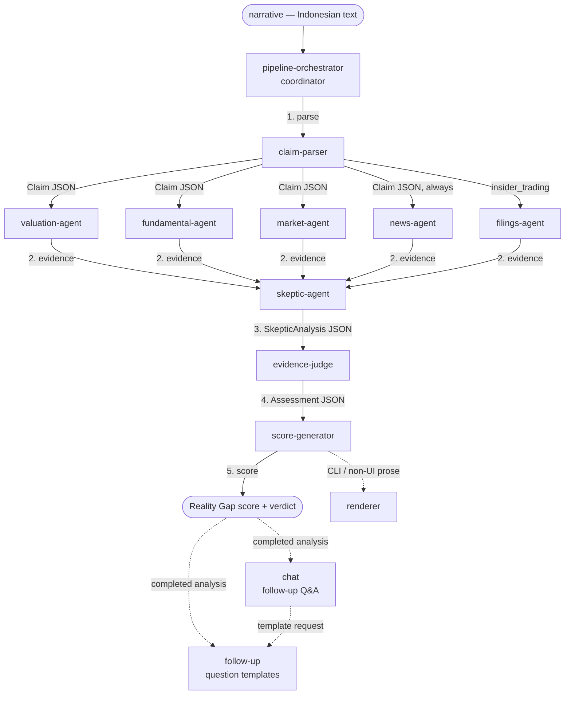

# Naragate Agents Template

A multi-agent template for the **Naragate Reality Gap** evidence engine. It defines the agent topology that turns an Indonesian market narrative into a Reality Gap score (0-100) and verdict, and it can be installed into any harness that supports multiple agents.

The template ships **13 agents — one per skill in the Naragate skills package** — so the generated topology covers the whole pipeline plus the follow-up/renderer utilities.

This template **complements** the Naragate skills package. Each agent loads its corresponding skill from `skills/`; the skills remain the single source of truth for the actual instructions. This template only wires the agents together.

## Topology



Support agents:

| Agent | Role |
|-------|------|
| `chat` | Drives follow-up Q&A: offers 3-5 follow-up question templates the user can pick from, or answers a custom-typed question, grounded only in the evidence |
| `follow-up` | Generates the 3-5 contextual follow-up question templates `chat` presents; usable standalone as a template generator |
| `renderer` | Converts any agent's JSON output into narrative prose for CLI / non-UI consumers |
| `pipeline-orchestrator` | Coordinate multi-stage pipeline execution |

These agents are available outside the main pipeline for secondary tasks.

> **Policy claims.** The `claim-parser` may emit `is_policy: true` with a `sector` + `sector_members` instead of a single `ticker` (e.g. *"subsidi BBM"*, *"HBA … ADRO"*, *"larangan ekspor bijih nikel … INCO"*). A policy keyword wins even when the narrative names a member ticker. These claims bypass the valuation/fundamental/market evidence agents and instead gather **sector-scoped evidence plus policy-event labeling** deterministically in the backend; the same `skeptic-agent` → `evidence-judge` → `score-generator` stages follow.

After a completed analysis, the `chat` agent runs the follow-up loop: it offers follow-up templates
(via the `follow-up` skill) as a numbered list, lets the user either pick one or type their own question,
answers it grounded solely in the analysis evidence, and allows a few more rounds (cap ~3). In UI surfaces
that already render suggestion chips, it skips the template step and answers the question directly.

## Agents

| Agent | Skill | Input | Output |
|-------|-------|-------|--------|
| `pipeline-orchestrator` | `pipeline-orchestrator` | narrative (text) | score + verdict |
| `claim-parser` | `claim-parser` | narrative (text) | Claim JSON |
| `valuation-agent` | `valuation-agent` | Claim JSON (valuation) | ValuationEvidence JSON |
| `fundamental-agent` | `fundamental-agent` | Claim JSON (fundamental) | FundamentalEvidence JSON |
| `market-agent` | `market-agent` | Claim JSON (market) | MarketEvidence JSON |
| `filings-agent` | `filings-agent` | Claim JSON (insider_trading) | FilingsEvidence JSON |
| `news-agent` | `news-agent` | Claim JSON | NewsEvidence JSON |
| `skeptic-agent` | `skeptic-agent` | Claim + evidence | SkepticAnalysis JSON |
| `evidence-judge` | `evidence-judge` | Claim + evidence + skeptic | Assessment JSON |
| `score-generator` | `score-generator` | Assessment + skeptic score | RealityGapScore JSON |
| `chat` | `chat` | question + completed analysis | answer (text) |
| `follow-up` | `follow-up` | completed analysis + preference profile | 3-5 follow-up templates JSON |
| `renderer` | `renderer` | any agent's JSON output | narrative prose |

## Layout

```
agents/
  agents.json              # pipeline stages, agent file list, package metadata
  *.md                     # neutral agent definitions (source of truth)
  install.py               # generator: emits harness-native agent files
  README.md
```

## Prerequisites

Install the Naragate skills first so each agent can load its skill:

```bash
npx skills add masdevid/naragate
```

## Install

The neutral definitions in `agents/` are the source of truth. `install.py` generates harness-native files.

```bash
# list supported harnesses
python agents/install.py --list

# generate for one harness into the current project
python agents/install.py --harness opencode

# generate for every harness into a specific directory (dry-run first)
python agents/install.py --all --out /path/to/project --dry-run
python agents/install.py --all --out /path/to/project
```

### Supported harnesses

| Harness | Generated files | Notes |
|---------|-----------------|-------|
| `claude-code` | `.claude/agents/<name>.md` | Claude Code subagents |
| `opencode` | `.opencode/agents/<name>.md` | OpenCode agents (file name = agent name) |
| `codex` | `.codex/agents/<name>.toml` | Codex custom agents |
| `pi` | `pi.json` | Pi harness manifest (`{name, skill}` per agent) |
| `deepagents` | `.deepagents/agent/<name>.md` | Deep Agents |

The generator does not hardcode a model or provider — each harness uses its default model. Set a per-agent model in the generated files if you want one.

## Extending

1. Add a neutral definition `agents/<name>.md` (frontmatter: `name`, `description`, `skill`, `mode`, `handoffs`, `input`, `output`; body = system prompt)
2. Add the filename to `agent_files` in `agents/agents.json` (and to `pipeline`/`support` as appropriate)
3. Re-run `python agents/install.py --all`

## Design notes

- **No duplication**: the neutral `.md` files are the single source of truth; generated harness files are derived artifacts, not edited by hand.
- **Skills stay canonical**: agents load skills by name; the template never embeds skill content.
- **No hardcoded credentials or budgets**: the harness injects the Sectors API key and credit budget at runtime.
- **MCP is the portable data layer**: agents are optional. For harnesses that prefer one tool surface over generated subagents, the `naragate-mcp` server ([`mcp/`](../mcp/README.md)) exposes the same primitives — with full `skills/*/tools.yaml` parity — to any MCP client, and always routes evidence through the backend's cache.

## References

- **[Sectors v2 API — Endpoint Coverage](references/ENDPOINTS.md)** — full endpoint catalog, per-market costs, and Naragate client coverage matrix