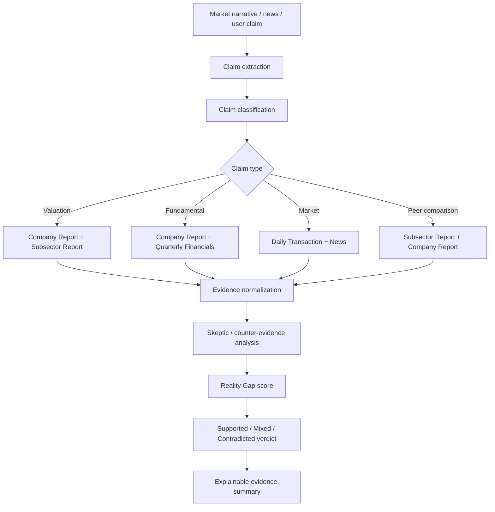
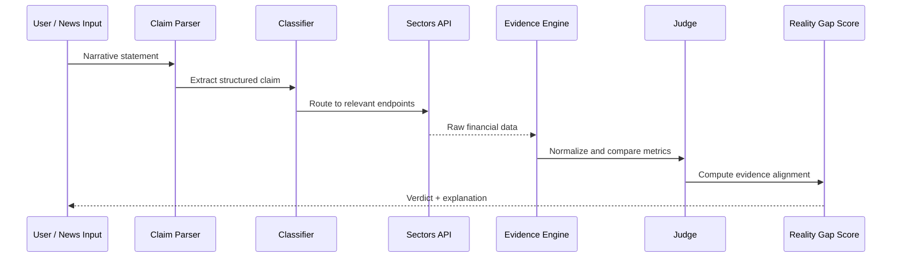
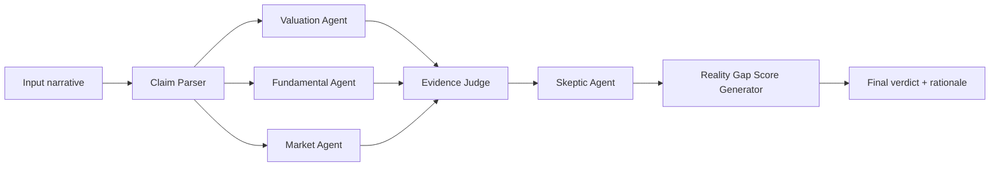
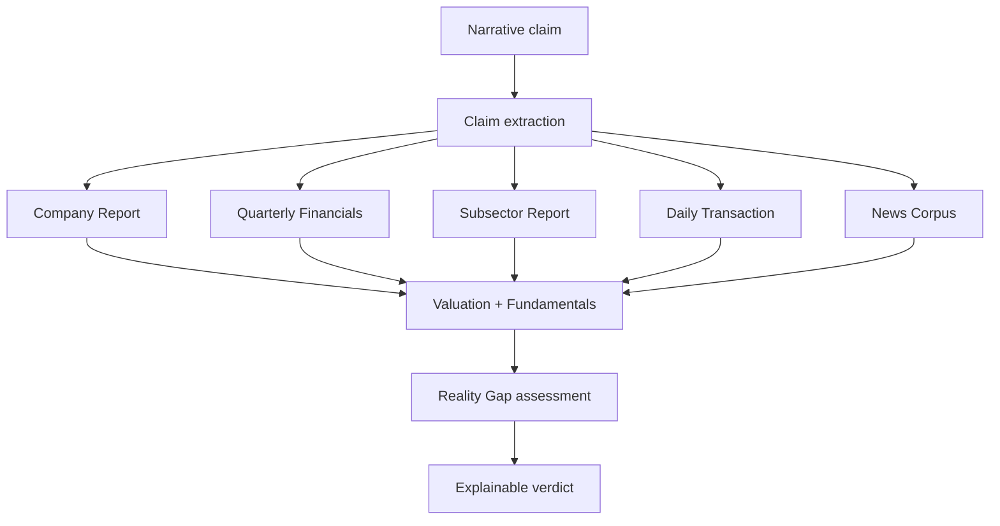
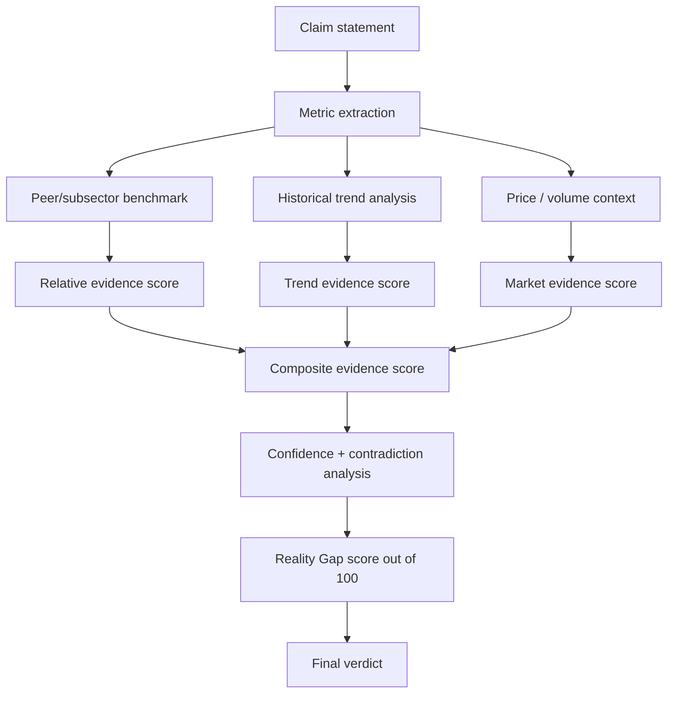
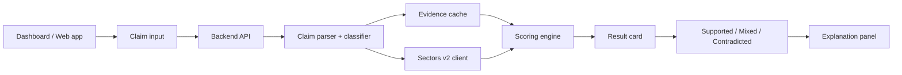

# Naragate — Mermaid Diagrams

## 1) High-level system architecture



## 2) Claim-to-evidence workflow



## 3) Multi-agent design



## 4) Evidence validation pattern

```mermaid
flowchart TD
    A[Claim: "BBRI labanya jeblok"] --> B[Classify claim]
    B --> C[Fetch quarterly financials]
    B --> D[Fetch company report]
    B --> E[Fetch peer & subsector benchmark]

    C --> F[Assess earnings trend]
    D --> G[Assess profitability metrics]
    E --> H[Assess relative valuation]

    F --> I[Aggregate evidence]
    G --> I
    H --> I

    I --> J{Does data support claim?}
    J -->|Yes| K[Supported]
    J -->|Partially| L[Mixed / Partially supported]
    J -->|No| M[Contradicted]
```

## 5) Data source mapping



## 6) Score computation logic



## 7) MVP architecture for hackathon demo


