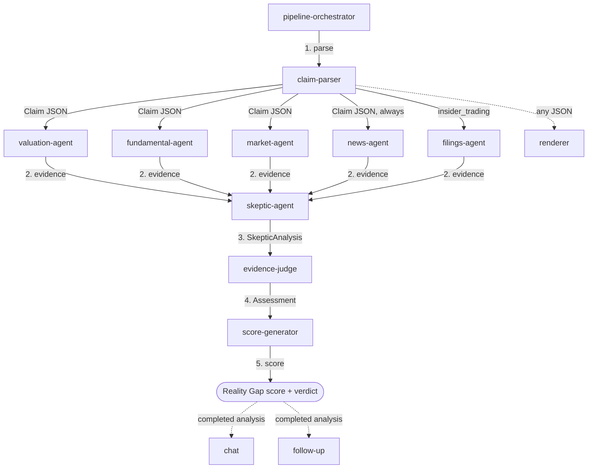

# Naragate Agent Skills

Installable, harness-agnostic agent skills for the Naragate evidence engine — detects financial claims in Indonesian market narratives and verifies them against Sectors v2 financial data.

## Installation

The skills live in this repo under `skills/`. Install from the repo root (the CLI auto-discovers the `skills/` subdirectory):

```bash
# From a local checkout
npx skills add /path/to/market-narrative-gap

# Or from the GitHub repo
npx skills add masdevid/naragate
```

Install a single skill:

```bash
npx skills add /path/to/market-narrative-gap --skill claim-parser
```

Install to a specific agent:

```bash
npx skills add /path/to/market-narrative-gap -a claude-code
```

## Skills

| Skill | Purpose |
|-------|---------|
| `claim-parser` | Extract structured financial claims from Indonesian market narratives |
| `valuation-agent` | Retrieve valuation evidence (PE, PB, PS, PCF) from Sectors v2 |
| `fundamental-agent` | Retrieve fundamental evidence (revenue, earnings, margins) from Sectors v2 |
| `market-agent` | Retrieve market performance evidence (price, volume, volatility) from Sectors v2 |
| `news-agent` | Analyze news headlines to corroborate or contradict a claim |
| `skeptic-agent` | Challenge a claim by re-interpreting the same evidence with a negation bias |
| `evidence-judge` | Aggregate evidence from all agents and the Skeptic into a unified assessment |
| `score-generator` | Compute the Reality Gap score (0-100) and verdict |
| `chat` | Answer follow-up questions about a completed Reality Gap analysis |
| `follow-up` | Generate personalized follow-up question templates for a completed analysis |
| `filings-agent` | Retrieve insider trading filings evidence for insider_trading claims |
| `pipeline-orchestrator` | Define the agent sequence as a standalone workflow any harness can invoke |
| `renderer` | Convert any agent's JSON output into narrative prose |

## Usage

Each skill outputs structured JSON. The `renderer` skill converts any agent's JSON output into narrative prose for non-UI consumers.

The `pipeline-orchestrator` skill defines the full pipeline sequence:



1. `claim-parser` → extract structured claim
2. Ticker guardrail — validate claim ticker is a valid 4-letter code before any evidence retrieval
3. Evidence agent (valuation/fundamental/market/insider_trading based on claim category) + `news-agent` → retrieve evidence
4. `skeptic-agent` → challenge the claim
5. `evidence-judge` → aggregate evidence
6. `score-generator` → compute Reality Gap score

## Configuration

Sectors API key, credit budget, and LLM provider are injected by the harness — they are not embedded in the skills. Each skill's `tools.yaml` describes the tools it needs; the harness provides the configured implementations.

## Development

Skills live in `skills/<name>/SKILL.md` with optional `skills/<name>/tools.yaml`. The `.pi/` directory is local-only harness config (gitignored); locally it symlinks `.pi/skills/<name>` to `skills/<name>` so the Pi CLI harness and web UI consume the same skill content without duplication.

## References

- **[Sectors v2 API — Endpoint Coverage](references/ENDPOINTS.md)** — full endpoint catalog, per-market costs, and Naragate client coverage matrix